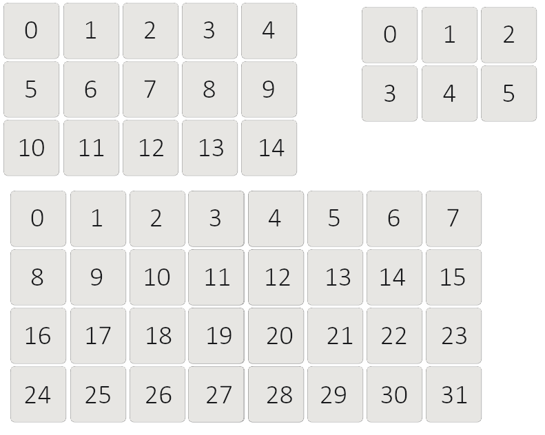

# Commands
This page explains all the commands available in CLI

## Device commands
Commands for controlling Stream Deck devices

### device list
Lists all available and managed devices

### device add \<serial number\>
Adds specified device to managed device list, you can tell the device is managed if Elgato logo has disappeared

### device remove \<serial number\>
Removes specified device from managed device list

## Module commands
Commands for modules and components

### module list
Lists all modules loaded by the daemon

### module info \<module name\>
Shows some more information about specified module

### module params
Contains commands for manipulating module parameters, explained in depth in [following page](parameters.md)

### component list
Lists all components added by loaded modules

### component info \<component name\>
Shows some more information about specified component

## Font list command
Following command shows list of loaded fonts
```shell
font list
```
Installation of custom fonts is explained in [this section](../daemon/configuration.md#custom-fonts)

## Selection command
Following command tells the CLI that you want to work with specified device. Current selection is specified on left from prompt arrow
```shell
select <serial number>
```
All following commands require a device to be selected

## Key index reference
Reference for key indices that CLI uses:


## Navigation commands
Commands for some navigation that can be done through CLI

### press \<key index\>
Simulates a press on a button, same thing as if a button on Stream Deck was pressed

### back \[drop\]
Goes back in screen stack, if using folders, it will do same thing as Folder Up component. If drop word is added to make `back drop`, will drop to root screen

### stack
Prints current stack of the device, which is usually the path you took with folders

## Configuration commands
Commands related to device configuration

### brightness \<0-100\>
Sets brightness of the device to specified value. 0 would disable the backlight

### config save
Saves device config to permanent storage

### config save all
Saves device configs of all managed devices

### config reload
Loads device config from permanent storage, overrides current state of the device

### config reload all
Loads device configs of all online managed devices, overrides their current states

### config export \<path\>
Saves device config into specified path, can be used to copy and paste configurations between devices, can be used also for backup

### config import \<path\>
Loads device config from specified path, overrides current state of the device

## Image commands
Commands related to image collections, some explanation is provided [here](../daemon/design.md#images-are-part-of-device-configuration) for what this is

### image list \[preview size\]
Shows list of saved images on the device with colored preview for each

Size of the preview can be controlled by providing a number representing length of the preview square's side in pixels

Previews are only supported on true color terminals, cmd will see only jibberish, this might be fixed in later updates

### image add \<path\>
Uploads image from specified path into Streamduck daemon, to be used later by button rendering

### image remove \<identifier\>
Removes image from image collection of the device, identifier can be looked up from `image list` or saved from moment of adding the image, as image identifier is printed as image is uploaded

## Button commands
Commands related to manipulating buttons on current screen

### button list
Lists buttons on current screen, some can appear there that cannot be seen on the Stream Deck screen, which usually means there's a button without a renderer component

### button info \<key index\>
Shows detailed information on specified button, which also includes list of components that the button has

### button new \<key index\>
Creates a new empty button on specified key, it will not have a renderer component, so for the button to appear visually on Stream Deck screen, add renderer component with [following command](#button-component-add-key-index-component-name)

### button from \<key index\> \<component name\>
Creates a new button using specified component as a template, comes with renderer as defined by the component

### button copy \<key index\>
Copies specified button into daemon's clipboard, to be later pasted by next command

### button paste \<key index\>
Pastes a button from daemon's clipboard onto specified key

Plugins get to handle this command, so in case of folders, you'll get a copy of the folder on the new button

### button remove \<key index\>
Removes button from specified key

Additionally, components might perform more cleanup, folder components will also delete folder data associated

### button component add \<key index\> \<component name\>
Adds a component onto specified button, does not create a button if it doesn't exist

See [this command](#component-list) to know what components are available

### button component remove \<key index\> \<component name\>
Removes specified component from the button, performs some cleanup in case component requires it

### button component params
Contains commands for manipulating component parameters, explained in depth in [following page](parameters.md)